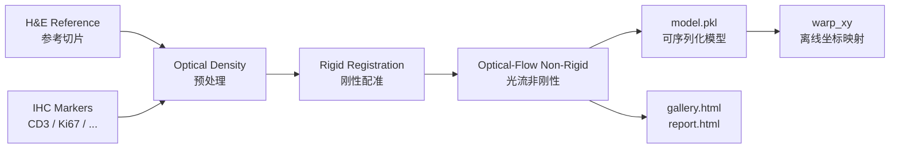

<p align="center">
  
</p>

<h1 align="center">🔬 HISAlign</h1>

<p align="center">
  <b>将多标记 IHC/IF 切片配准到 H&E 参考切片 · Whole-slide alignment for H&E and multiplex IHC</b>
</p>

<p align="center">
  <a href="#"></a>
  <a href="#"></a>
  <a href="#"></a>
</p>

---

> 💡 **一句话介绍 / One-liner**  
> HISAlign 把每张 IHC marker 切片的空间坐标统一到同一张 H&E 切片上，输出一个可离线使用的 `.pkl` 配准模型。  
> HISAlign registers each IHC marker slide into the H&E reference space and produces a standalone `.pkl` alignment model for offline coordinate mapping.

---

## ✨ 为什么需要 HISAlign / Why HISAlign

| 问题 / Problem | HISAlign 的做法 / Solution |
| --- | --- |
| 同一组织切了 H&E 和多张 IHC，空间位置对不上 | 刚性 + 光流非刚性配准，逐 marker 对齐到 H&E |
| 配准结果依赖打开的切片句柄，难以复用 | 只保存 numpy 数组与变换参数，完全可序列化 |
| 下游分析需要把 HE 上的 ROI 坐标转到 IHC | 离线 `warp_xy` 接口，输入 level-0 坐标即可 |
| 需要快速评估配准质量 | 自动生成 patch 级 gallery 与 slide 级 report |

---

## 🎨 工作流程 / Workflow



---

## 🚀 安装 / Installation

```bash
uv sync && uv pip install -e .
```

验证入口：

```bash
hisalign --help
```

---

## 🧪 30 秒上手 / Quickstart

### Python API

```python
from hisalign import HisAlign, HisAlignModel

# 1. 配准并保存模型 / Fit and save the model
aligner = HisAlign(
    he_path="HE.kfb",
    ihc_paths={"CD3": "CD3.svs", "Ki67": "Ki67.svs"},
    registration_level=3,
    max_image_dim_px=1024,
    preprocessing="od",
    feature_detector="kaze",
    mpp=0.25,  # 当切片元数据缺少 MPP 时显式指定
)
model = aligner.fit()
model.save("model.pkl")

# 2. 离线坐标映射 / Offline coordinate mapping
loaded = HisAlignModel.load("model.pkl")
mapped = loaded.warp_xy(
    coords=[[1000, 2000]],  # HE level-0 像素坐标
    marker="CD3",
    direction="he_to_ihc",
)
print(mapped)  # -> [[ihc_x, ihc_y]]
```

### 命令行 / CLI

**1. 配准 / Register**

```bash
hisalign register \
  --he HE.kfb \
  --ihc CD3=CD3.svs \
  --ihc Ki67=Ki67.svs \
  --output model.pkl \
  --config configs/default.yaml \
  --mpp 0.25
```

> 可省略 `marker=`，marker 名会从文件名的最后一段自动提取。  
> If you omit `marker=`, the marker name is derived from the last token of the filename stem.

**2. 坐标映射 / Warp coordinates**

```bash
hisalign warp \
  --model model.pkl \
  --marker CD3 \
  --direction he_to_ihc \
  --coords coords.csv \
  --output mapped.csv
```

**3. 生成可视化 / Visualize**

```bash
hisalign visualize \
  --model model.pkl \
  --output-dir ./out \
  --config configs/default.yaml
```

---

## 🖼️ 也能玩普通图片 / Works with plain images too

如果只是想用两张 `.jpg`/`.png` 做快速实验，见 `examples/register_jpg.py`：

```bash
python examples/register_jpg.py --synthetic --output-dir ./out
```

For a minimal example using plain `.jpg`/`.png` images instead of whole-slide formats, run:

```bash
python examples/register_jpg.py --he he.jpg --ihc ihc.jpg --output-dir ./out
```

---

## 📐 坐标约定 / Coordinate Convention

> ⚠️ **所有坐标均为 level-0（最高分辨率）像素坐标。**  
> **All coordinates are level-0 (highest resolution) pixel coordinates.**

- 顺序为 `(x, y)`，即 `(列, 行)` / Order is `(x, y)` = `(column, row)`.
- 原点在切片左上角 / Origin is the top-left corner.
- 其他层级坐标请手动缩放到 level-0 后再调用 `warp_xy`.  
  For coordinates from another pyramid level, scale them to level-0 first.

---

## 📦 支持格式 / Supported Formats

| 类型 / Type | 格式 / Formats |
| --- | --- |
| KFBio 原生 | `.kfb` |
| OpenSlide | `.svs`, `.tif`/`.tiff`, `.ndpi`, `.vms`/`.vmu`, `.mrxs`, `.scn` |
| 普通图片 / Plain images | `.jpg`, `.jpeg`, `.png`, `.bmp` |

---

## 📤 输出 / Outputs

运行 `hisalign register` 后，你会得到：

- `model.pkl` — 可序列化的配准模型，包含所有空间变换参数，后续无需打开原始切片。

若开启可视化，还会在同目录生成：

- `gallery.html` — **patch 级别**随机采样可视化，对比 HE 与每个 marker 的 IHC patch。
- `report.html` — **slide 级别**配准质量报告，含叠加图、rTRE、marker 缩略图与形变场。

---

## ⚙️ 配置 / Configuration

`configs/default.yaml` 关键项：

```yaml
registration_level: 3          # 配准金字塔层级
max_image_dim_px: 1024         # 配准图像最大边长
preprocessing: "od"            # "od" 光学密度 ｜ "gray" 普通灰度
feature_detector: "kaze"       # kaze / akaze / sift / orb / brisk
feature_n_levels: 3
match_max_ratio: 1.0           # Lowe ratio test，1.0 关闭
mpp: null                      # level-0 像素尺寸（µm/px），缺失时显式设置

# 可视化
viz_sample_n: 5                # gallery 采样 patch 数，0 不生成
generate_report: true          # 是否生成 report.html
report_rtre_threshold: 5.0     # rTRE 良好阈值
```

---

## 🗂️ 项目结构 / Project Structure

```text
hisalign/
├── README.md
├── pyproject.toml
├── configs/default.yaml
├── examples/
│   └── register_jpg.py          # 普通图片配准示例
├── src/hisalign/
│   ├── api.py                   # HisAlign / HisAlignModel
│   ├── cli.py                   # 命令行入口
│   ├── preprocessing.py         # OD / 灰度预处理
│   ├── registration/            # 刚性 + 非刚性配准核心
│   ├── slide_io/                # WSI / 普通图片读取后端
│   └── viz.py                   # 可视化
└── tests/
```

---

## 🧪 测试 / Tests

```bash
# 快速测试
uv run pytest tests/ -v

# 包含真实切片数据的慢速集成测试
uv run pytest tests/ -v -m slow
```

---

## 🙋 作者 / Author

Created with 💙 by **Yifan Feng**  
📧 [evanfeng97@gmail.com](mailto:evanfeng97@gmail.com)

---

## 📚 参考 / References

- VALIS: Virtual Alignment of pathology Image Series
- DISK: Learning local features with policy gradient (Tyszkiewicz et al., NeurIPS 2020)
- LightGlue: Local Feature Matching at Light Speed (Lindenberger et al., CVPR 2023)

---

<p align="center">
  <i>让病理切片的空间对齐像拼图一样直观。</i><br>
  <i>Making whole-slide alignment as intuitive as solving a jigsaw puzzle.</i>
</p>
