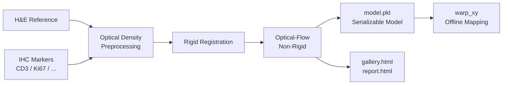

<p align="center">
  
</p>

<h1 align="center">🔬 HISAlign</h1>

<p align="center">
  <b>Whole-slide image alignment for H&E and multiplex IHC markers</b>
</p>

<p align="center">
  <a href="#"></a>
  <a href="#"></a>
  <a href="#"></a>
  <span> · </span>
  <a href="README.zh.md">简体中文</a>
</p>

---

> 💡 **One-liner**  
> HISAlign registers each IHC marker slide into the H&E reference space and produces a standalone `.pkl` alignment model for offline coordinate mapping.

---

## ✨ Why HISAlign

| Problem | Solution |
| --- | --- |
| H&E and multiple IHC slides of the same tissue are spatially misaligned | Rigid + optical-flow non-rigid registration, per-marker alignment to H&E |
| Registration results depend on open slide handles and are hard to reuse | Only numpy arrays and transform parameters are saved; fully serializable |
| Downstream analysis needs to map ROIs from H&E to IHC | Offline `warp_xy` interface: provide level-0 coordinates and get mapped coordinates |
| Need a quick way to assess registration quality | Optional patch-level `gallery.html` and slide-level `report.html` |

---

## 🎨 Workflow



---

## 🚀 Installation

```bash
uv sync && uv pip install -e .
```

Verify the CLI entry point:

```bash
hisalign --help
```

---

## 🧪 Quickstart

### Python API

```python
from hisalign import HisAlign, HisAlignModel

# 1. Fit and save the model
aligner = HisAlign(
    he_path="HE.kfb",
    ihc_paths={"CD3": "CD3.svs", "Ki67": "Ki67.svs"},
    registration_level=3,
    max_image_dim_px=1024,
    preprocessing="od",
    feature_detector="kaze",
    mpp=0.25,  # explicit when slide metadata lacks MPP
)
model = aligner.fit()
model.save("model.pkl")

# 2. Offline coordinate mapping (no slides needed)
loaded = HisAlignModel.load("model.pkl")
mapped = loaded.warp_xy(
    coords=[[1000, 2000]],  # H&E level-0 pixel coordinates
    marker="CD3",
    direction="he_to_ihc",
)
print(mapped)  # -> [[ihc_x, ihc_y]]
```

### CLI

**1. Register and save the model**

```bash
hisalign register \
  --he HE.kfb \
  --ihc CD3=CD3.svs \
  --ihc Ki67=Ki67.svs \
  --output model.pkl \
  --config configs/default.yaml \
  --mpp 0.25
```

> If you omit `marker=`, the marker name is derived from the last token of the filename stem.

**2. Warp coordinates with the model**

```bash
hisalign warp \
  --model model.pkl \
  --marker CD3 \
  --direction he_to_ihc \
  --coords coords.csv \
  --output mapped.csv
```

The input CSV must contain `x` and `y` columns; the output adds `marker` and `direction` columns.

**3. Generate visualizations**

```bash
hisalign visualize \
  --model model.pkl \
  --output-dir ./out \
  --config configs/default.yaml
```

`register` also generates `gallery.html` and `report.html` automatically when visualization is enabled.

---

## 🖼️ Works with Plain Images Too

The repo includes whole-slide thumbnail exports of an H&E slide and a CD3 IHC slide (`examples/images/he.jpg` and `examples/images/ihc.jpg`) for a quick demo:

```bash
python examples/register_jpg.py --output-dir ./out
```

For synthetic data:

```bash
python examples/register_jpg.py --synthetic --output-dir ./out
```

Or provide your own images:

```bash
python examples/register_jpg.py --he he.jpg --ihc ihc.jpg --output-dir ./out
```

---

## 📐 Coordinate Convention

> ⚠️ **All coordinates are level-0 (highest resolution) pixel coordinates.**

- Order is `(x, y)` = `(column, row)`.
- Origin is the top-left corner.
- For coordinates from another pyramid level, scale them to level-0 first.

---

## 📦 Supported Formats

| Type | Formats |
| --- | --- |
| KFBio native | `.kfb` |
| OpenSlide | `.svs`, `.tif`/`.tiff`, `.ndpi`, `.vms`/`.vmu`, `.mrxs`, `.scn` |
| Plain images | `.jpg`, `.jpeg`, `.png`, `.bmp` |

---

## 📤 Outputs

After running `hisalign register`:

- `model.pkl` — serializable alignment model containing all spatial transforms; no original slides required afterwards.

If visualization is enabled, the same directory also contains:

- `gallery.html` — **patch-level** random sampling visualization comparing H&E patches with each marker's IHC patch.
- `report.html` — **slide-level** registration quality report with overlay comparisons, rTRE statistics, per-marker thumbnails, and deformation fields.

---

## ⚙️ Configuration

Key items in `configs/default.yaml`:

```yaml
registration_level: 3          # pyramid level used for registration
max_image_dim_px: 1024         # longest side of the processed registration image
preprocessing: "od"            # "od" optical density | "gray" simple grayscale
feature_detector: "kaze"       # kaze / akaze / sift / orb / brisk
feature_n_levels: 3
match_max_ratio: 1.0           # Lowe ratio test; 1.0 disables
mpp: null                      # level-0 pixel size (µm/px); set when metadata is missing

# Visualization
viz_sample_n: 5                # number of patches in gallery, 0 to disable
generate_report: true          # whether to generate report.html
report_rtre_threshold: 5.0     # rTRE threshold for "good" highlighting
```

---

## 🗂️ Project Structure

```text
hisalign/
├── README.md
├── README.zh.md
├── pyproject.toml
├── configs/default.yaml
├── examples/
│   ├── register_jpg.py
│   └── images/
│       ├── he.jpg
│       └── ihc.jpg
├── src/hisalign/
│   ├── api.py
│   ├── cli.py
│   ├── preprocessing.py
│   ├── registration/
│   ├── slide_io/
│   └── viz.py
└── tests/
```

---

## 🧪 Try It

The fastest way to verify the installation and see HISAlign in action is to run the bundled example:

```bash
python examples/register_jpg.py --output-dir ./out
```

This registers the real whole-slide thumbnails in `examples/images/` and produces:

- `out/model.pkl`
- `out/00_unregistered.png`
- `out/01_rigid.png`
- `out/02_nonrigid.png`

### Example Results

After running the command above, open the generated overlays:

- `out/00_unregistered.png` — green/magenta overlay before registration (structures are shifted).
- `out/01_rigid.png` — overlay after rigid registration.
- `out/02_nonrigid.png` — overlay after non-rigid registration; overlapping structures turn white/gray.

Green = H&E, magenta = CD3 IHC.

---

## 🙋 Author

Created with 💙 by **Yifan Feng**  
📧 [evanfeng97@gmail.com](mailto:evanfeng97@gmail.com)

---

## 📚 References

- VALIS: Virtual Alignment of pathology Image Series
- DISK: Learning local features with policy gradient (Tyszkiewicz et al., NeurIPS 2020)
- LightGlue: Local Feature Matching at Light Speed (Lindenberger et al., CVPR 2023)

---

<p align="center">
  <i>Making whole-slide alignment as intuitive as solving a jigsaw puzzle.</i>
</p>
