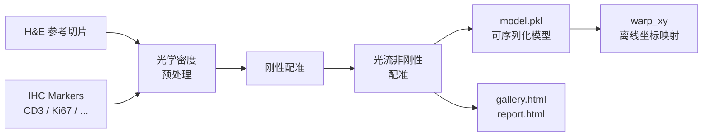

<p align="center">
  
</p>

<h1 align="center">🔬 HISAlign</h1>

<p align="center">
  <b>H&E 与多重 IHC marker 全切片图像配准</b>
</p>

<p align="center">
  <a href="#"></a>
  <a href="#"></a>
  <a href="#"></a>
  <span> · </span>
  <a href="README.md">English</a>
</p>

---

> 💡 **一句话介绍**  
> HISAlign 将每张 IHC marker 切片配准到 H&E 参考切片空间，并输出一个可离线使用的 `.pkl` 配准模型。

---

## ✨ 为什么需要 HISAlign

| 问题 | HISAlign 的做法 |
| --- | --- |
| 同一组织切了 H&E 和多张 IHC，空间位置对不上 | 刚性 + 光流非刚性配准，逐 marker 对齐到 H&E |
| 配准结果依赖打开的切片句柄，难以复用 | 只保存 numpy 数组与变换参数，完全可序列化 |
| 下游分析需要把 HE 上的 ROI 坐标转到 IHC | 离线 `warp_xy` 接口，输入 level-0 坐标即可 |
| 需要快速评估配准质量 | 自动生成 patch 级 gallery 与 slide 级 report |

---

## 🎨 工作流程



---

## 🚀 安装

```bash
uv sync && uv pip install -e .
```

验证入口：

```bash
hisalign --help
```

---

## 🧪 快速开始

### Python API

```python
from hisalign import HisAlign, HisAlignModel

# 1. 配准并保存模型
aligner = HisAlign(
    he_path="HE.kfb",
    ihc_paths={"CD3": "CD3.svs", "Ki67": "Ki67.svs"},
    registration_level=3,
    max_image_dim_px=1024,
    preprocessing="od",
    feature_detector="kaze",
    mpp=0.25,  # 当切片元数据缺少 MPP 时显式指定
)
model = aligner.fit()
model.save("model.pkl")

# 2. 离线坐标映射（不需要打开切片）
loaded = HisAlignModel.load("model.pkl")
mapped = loaded.warp_xy(
    coords=[[1000, 2000]],  # HE level-0 像素坐标
    marker="CD3",
    direction="he_to_ihc",
)
print(mapped)  # -> [[ihc_x, ihc_y]]
```

### 命令行

**1. 配准并保存模型**

```bash
hisalign register \
  --he HE.kfb \
  --ihc CD3=CD3.svs \
  --ihc Ki67=Ki67.svs \
  --output model.pkl \
  --config configs/default.yaml \
  --mpp 0.25
```

> 可省略 `marker=`，marker 名会从文件名的最后一段自动提取。

**2. 基于模型做坐标映射**

```bash
hisalign warp \
  --model model.pkl \
  --marker CD3 \
  --direction he_to_ihc \
  --coords coords.csv \
  --output mapped.csv
```

输入 `coords.csv` 需要包含 `x`、`y` 两列；输出会额外包含 `marker`、`direction` 列。

**3. 生成可视化报告**

```bash
hisalign visualize \
  --model model.pkl \
  --output-dir ./out \
  --config configs/default.yaml
```

`register` 命令也会根据配置自动生成 `gallery.html` 和 `report.html`。

---

## 🖼️ 也能玩普通图片

仓库里自带了一对从真实 WSI 导出的缩略图（`examples/images/he.jpg` 与 `examples/images/ihc.jpg`），可以直接跑：

```bash
python examples/register_jpg.py --output-dir ./out
```

如果想用合成数据做最小可复现实验：

```bash
python examples/register_jpg.py --synthetic --output-dir ./out
```

或者用你自己的 `.jpg`/`.png`：

```bash
python examples/register_jpg.py \
  --he path/to/he.jpg \
  --ihc path/to/ihc.jpg \
  --output-dir ./out
```

---

## 📐 坐标约定

> ⚠️ **所有坐标均为 level-0（最高分辨率）像素坐标。**

- 顺序为 `(x, y)`，即 `(列, 行)`。
- 原点在切片左上角。
- 其他层级坐标请手动缩放到 level-0 后再调用 `warp_xy`。

---

## 📦 支持格式

| 类型 | 格式 |
| --- | --- |
| KFBio 原生 | `.kfb` |
| OpenSlide | `.svs`, `.tif`/`.tiff`, `.ndpi`, `.vms`/`.vmu`, `.mrxs`, `.scn` |
| 普通图片 | `.jpg`, `.jpeg`, `.png`, `.bmp` |

---

## 📤 输出

运行 `hisalign register` 后，你会得到：

- `model.pkl` — 可序列化的配准模型，包含所有坐标变换信息，后续无需打开原始切片。

如果开启可视化，还会在同目录生成：

- `gallery.html` — **patch 级别**随机采样可视化，对比 HE patch 与其对应的各 marker IHC patch。
- `report.html` — **slide 级别**配准质量报告，含叠加图、rTRE 统计、每个 marker 的缩略图与形变场。

---

## ⚙️ 配置

`configs/default.yaml` 关键项：

```yaml
registration_level: 3          # 配准使用的金字塔层级
max_image_dim_px: 1024         # 配准图像最大边长
preprocessing: "od"            # "od" 光学密度 ｜ "gray" 普通灰度
feature_detector: "kaze"       # kaze / akaze / sift / orb / brisk
feature_n_levels: 3
match_max_ratio: 1.0           # Lowe ratio test，1.0 关闭
mpp: null                      # level-0 像素尺寸（µm/px），缺失时显式设置

# 可视化
viz_sample_n: 5                # gallery 采样 patch 数，0 不生成
generate_report: true          # 是否生成 report.html
report_rtre_threshold: 5.0     # rTRE 良好阈值
```

---

## 🗂️ 项目结构

```text
hisalign/
├── README.md
├── README.zh.md
├── pyproject.toml
├── configs/default.yaml
├── examples/
│   ├── register_jpg.py
│   └── images/
│       ├── he.jpg
│       └── ihc.jpg
├── src/hisalign/
│   ├── api.py
│   ├── cli.py
│   ├── preprocessing.py
│   ├── registration/
│   ├── slide_io/
│   └── viz.py
└── tests/
```

---

## 🧪 快速体验

验证安装并直观感受 HISAlign 效果的最快方式，是直接运行仓库自带的例子：

```bash
python examples/register_jpg.py --output-dir ./out
```

这条命令会对 `examples/images/` 里的真实 WSI 缩略图进行配准，并生成：

- `out/model.pkl`
- `out/00_unregistered.png`
- `out/01_rigid.png`
- `out/02_nonrigid.png`

### 配准效果示例

运行上面的命令后，打开生成的叠加图即可看到效果：

- `out/00_unregistered.png` — 配准前的绿/洋红叠加图，结构存在偏移。
- `out/01_rigid.png` — 刚性配准后的叠加图。
- `out/02_nonrigid.png` — 非刚性配准后的叠加图，结构重合处会呈现白/灰色。

绿色 = H&E，洋红色 = CD3 IHC。

---

## 🙋 作者

Created with 💙 by **Yifan Feng**  
📧 [evanfeng97@gmail.com](mailto:evanfeng97@gmail.com)

---

## 📚 参考

- VALIS: Virtual Alignment of pathology Image Series
- DISK: Learning local features with policy gradient (Tyszkiewicz et al., NeurIPS 2020)
- LightGlue: Local Feature Matching at Light Speed (Lindenberger et al., CVPR 2023)

---

<p align="center">
  <i>让病理切片的空间对齐像拼图一样直观。</i>
</p>
